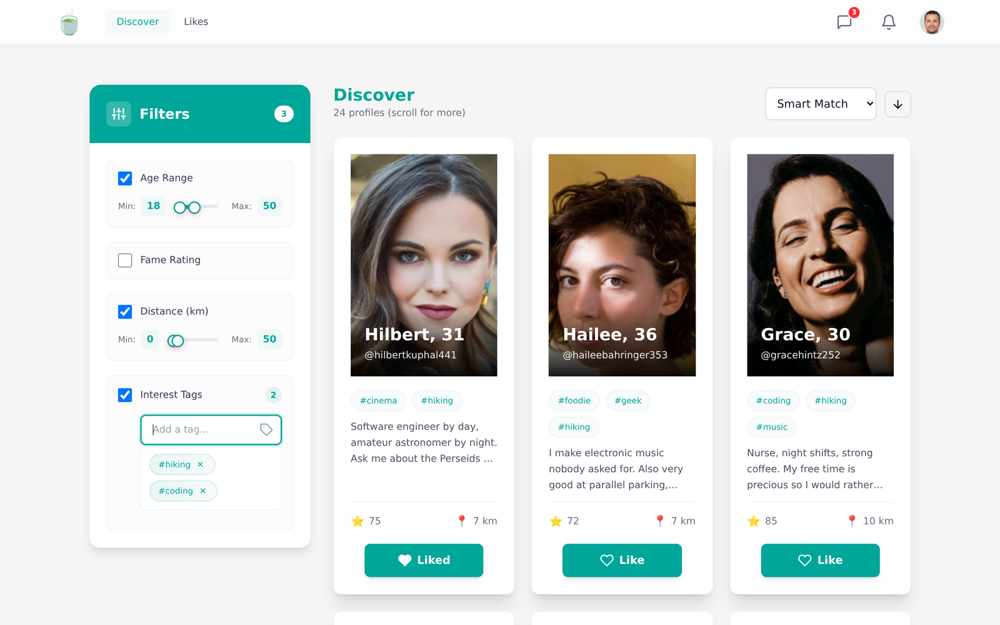
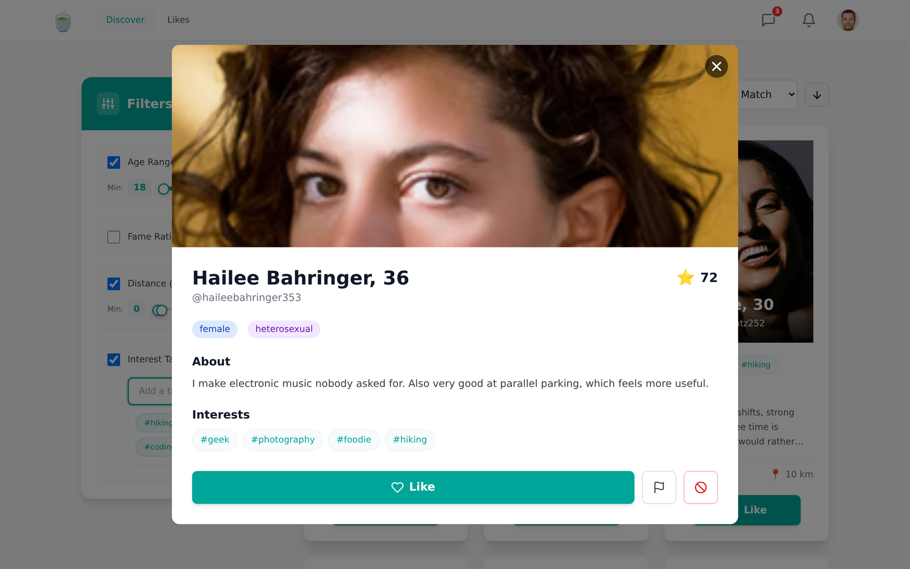
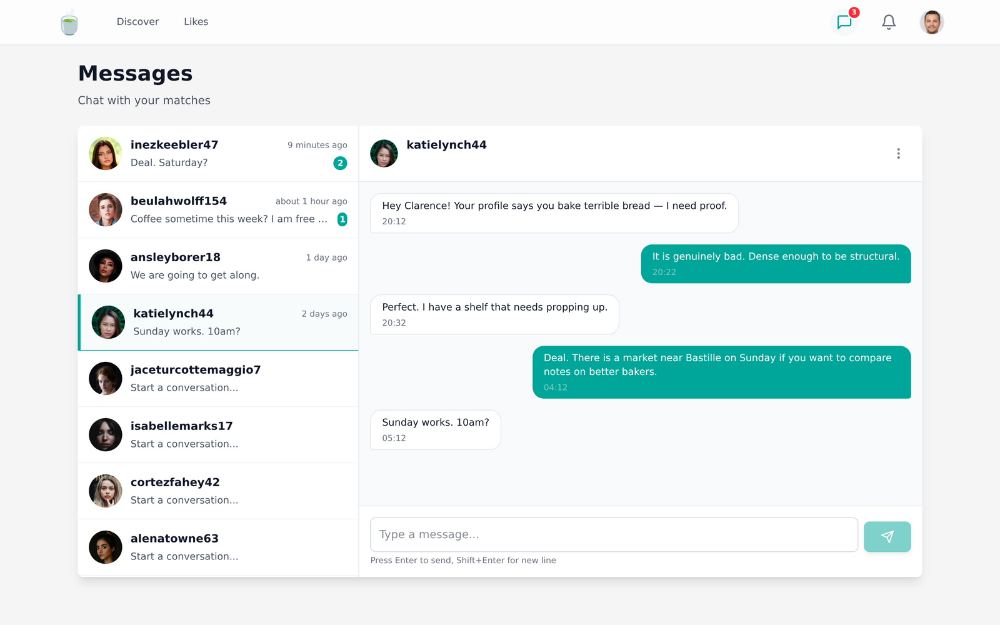
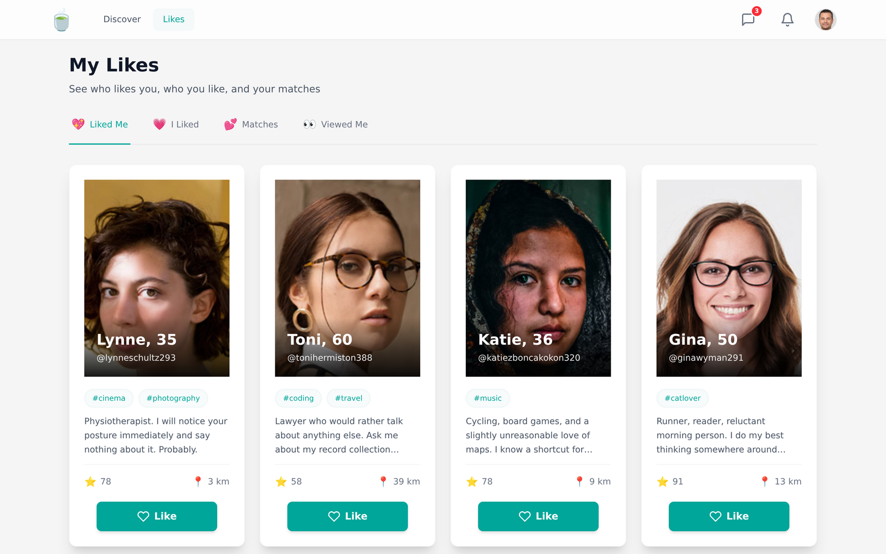

<p align="center">
  
</p>

<h1 align="center">Matcha</h1>

<p align="center">
  A dating web application built for the 42 school curriculum,<br>
  from sign-up and profile building to matching and real-time chat.
</p>

<p align="center">
  
  
  
  
  
  
</p>

---

## Demo


Two sessions side by side. Clarence likes Inez back from the *Liked Me* tab, both sides get the
match notification at the same moment, and the conversation that opens updates live, typing
indicator included. No page reload anywhere in the clip.

---

## Table of contents

- [Features](#features)
- [Screenshots](#screenshots)
- [Getting started](#getting-started)
- [Project structure](#project-structure)
- [Architecture](#architecture)
- [API & real-time](#api--real-time)
- [Smart Match](#smart-match)
- [Fame rating](#fame-rating)
- [Security](#security)

---

## Features

**Account**
- Registration with a strength-checked password and an email verification link
- Password reset by email, log out from any page
- JWT sessions (1 h, or 30 days with *Remember me*)

**Profile**
- Gender, sexual preference, biography, reusable interest tags, up to 5 photos (one profile picture)
- Location from browser GPS, a manual search (OpenStreetMap / Nominatim), or an IP-based fallback
- Guided onboarding: about → interests → photos → location
- See who viewed your profile and who liked you

**Discover & search**
- Suggestions filtered by sexual preference, ranked by the [Smart Match](#smart-match) score
- Sort by smart score, distance, age, fame or number of common tags
- Filter by age range, fame range, distance and interest tags, with infinite scroll

**Interactions**
- Like / unlike, mutual like creates a match and unlocks the chat
- Unliking a match deletes the conversation on both sides
- Report a fake account, block a user (blocked users disappear from search, likes and chat)
- Online status and last connection time

**Real-time** *(Socket.IO, no polling)*
- One-to-one chat between matched users, with a typing indicator
- Live notifications: like received, profile viewed, new message, mutual like, unlike
- Unread badges on the chat and bell icons, visible from every page

---

## Screenshots

<table>
  <tr>
    <td width="50%"></td>
    <td width="50%"></td>
  </tr>
  <tr>
    <td align="center"><b>Discover</b>: Smart Match ranking with age, distance and tag filters</td>
    <td align="center"><b>Profile</b>: photo carousel, tags, like / report / block</td>
  </tr>
  <tr>
    <td width="50%"></td>
    <td width="50%"></td>
  </tr>
  <tr>
    <td align="center"><b>Chat</b>: conversations with matches, unread counters</td>
    <td align="center"><b>Likes</b>: liked me / I liked / matches / viewed me</td>
  </tr>
</table>

---

## Getting started

### 1. Environment

Copy `.env.example` to `.env` at the project root and fill in your own database, JWT and SMTP
credentials. Every service reads its configuration from there.

```bash
cp .env.example .env
```

### 2. Run

```bash
docker compose up --build
```

| Service | URL                                            |
| ------- | ---------------------------------------------- |
| Client  | [localhost:5173](http://localhost:5173)        |
| API     | [localhost:5000](http://localhost:5000)        |
| Adminer | [localhost:8080](http://localhost:8080)        |

### 3. Seed the database

The 42 subject requires at least 500 distinct profiles. The seeder creates 500 verified users with
photos, tags, likes, views and blocks, then writes their credentials to `server/users_data.csv` so
you can log in as any of them.

```bash
docker exec -it matcha_server pnpm seed
```

### Reset the database

```bash
docker compose down
docker run --rm -v "$PWD":/app -w /app alpine rm -rf data
```

### Running a service on its own

```bash
cd client && npm install && npm run dev     # Vite dev server
cd server && pnpm install && pnpm nodemon index.js
```

---

## Project structure

```
.
├── client/                 React 19 + Vite + Tailwind v4
│   └── src/
│       ├── api/            Axios instance, JWT interceptor, 401 handling
│       ├── components/     Layout, ProfileCard, FilterSidebar, chat/, ui/, profile-steps/
│       ├── context/        AuthContext, ChatContext, NotificationContext
│       ├── pages/          App router, Login, Register, Home, Chat, MyLikes, EditProfile…
│       └── utils/          geocoding, image URLs
├── server/                 Express 5 + node-postgres (raw SQL, no ORM)
│   ├── config/             pg pool
│   ├── controllers/        auth, profile, browsing, like, view, block, report, chat, image
│   ├── db/init.sql         schema, run automatically on boot
│   ├── middleware/         JWT auth, per-domain validation
│   ├── routes/             one router per domain
│   ├── utils/              fameRating, distance, validation, emailService, fileUpload, queryHelpers
│   ├── socket.js           Socket.IO server (auth, chat, typing, notifications)
│   └── seed.js             500+ fake profiles
├── docs/                   README assets
└── docker-compose.yml      db · server · client · adminer
```

---

## Architecture

```
Browser ──HTTP/JWT──▶ Express 5 ──SQL──▶ PostgreSQL 15
   │                     │
   └───WebSocket─────────┘
        Socket.IO
```

**Client.** React Router v7 splits public routes from protected ones behind `PrivateRoute`; the JWT
lives in `localStorage` and is injected by an Axios interceptor that redirects to `/login` on a 401.
Three contexts hold the shared state: `AuthContext` (session), `ChatContext` (conversations,
messages, typing) and `NotificationContext` (socket connection, unread count, toasts).

**Server.** Express 5 with one router and one controller per domain. Validation lives in dedicated
middleware, business rules in the controllers, and SQL helpers are shared through
`utils/queryHelpers.js`. The schema in `db/init.sql` is applied on every boot, so a fresh volume
becomes a working database on its own.

**Database.** PostgreSQL 15 driven by `pg`: raw parameterised SQL only, no ORM, as the subject
requires.

| Table           | Purpose                                                       |
| --------------- | ------------------------------------------------------------- |
| `users`         | Identity, auth tokens, profile fields, GPS, fame, online status |
| `tags`          | Reusable interest tags                                         |
| `user_tags`     | Many-to-many between users and tags                            |
| `user_images`   | Up to 5 photos per user, one flagged as profile picture        |
| `likes`         | Directed likes, two opposite rows make a match                 |
| `profile_views` | Unique profile views                                           |
| `blocks`        | Blocked pairs                                                  |
| `reports`       | Fake-account reports                                           |
| `notifications` | Persisted notification feed                                    |
| `messages`      | One-to-one chat messages, with a read flag                     |

---

## API & real-time

The REST API lives under `http://localhost:5000/api`; every route except `/auth/*` expects an
`Authorization: Bearer <token>` header.

| Prefix | What it covers |
| ------ | -------------- |
| `/auth` | register, login, email verification, password reset |
| `/profile` | own profile, another user's profile, tags, photo upload |
| `/browsing` | `recommendations` (Smart Match) and `search`, both sortable and filterable |
| `/likes` · `/views` | likes sent and received, matches, profile views |
| `/blocks` · `/reports` | blocking and fake-account reports |
| `/chat` | conversations, history, read receipts |

Chat and notifications run over a single authenticated Socket.IO connection instead: the client
joins a private `user:<id>` room on connect, and the server pushes messages, typing indicators,
online status and notifications (`like`, `match`, `view`, `unlike`, `message`) to it. Nothing is
polled, and match and block rules are re-checked server-side on every message.

---

## Smart Match

Suggestions are ranked by a weighted composite score out of 100:

```
score = distance × 0.40  +  common_tags × 0.25  +  age_proximity × 0.20  +  fame × 0.15
```

| Component        | Weight | Formula                                   |
| ---------------- | ------ | ----------------------------------------- |
| Distance         | 40 %   | `100 × exp(-km / 50)`, exponential decay  |
| Common tags      | 25 %   | `min(100, tags / 5 × 100)`                |
| Age proximity    | 20 %   | `100 × exp(-\|ageDiff\| / 10)`              |
| Fame rating      | 15 %   | the fame score, clamped to 0–100          |

Distance carries the most weight on purpose: the subject asks that "priority should be given to
users within the same geographical area". Distances come from the Haversine formula on the stored
latitude/longitude. Users without a known location fall back to a neutral 50 on that component.

The other sort modes are plain orderings: `distance`, `age`, `fame`, or `tags` (common tag count,
then fame as a tie-breaker).

Implementation: `server/controllers/browsingController.js`.

---

## Fame rating

Fame reflects popularity *and* profile quality. It is recomputed from scratch on every relevant
event, so it can go down as well as up: unliking someone lowers their score.

```
fame = like_ratio × 80  +  photos × 2  +  profile_complete × 10  -  blocks × 3  -  reports × 5
```

| Component            | Points        | Notes                                              |
| -------------------- | ------------- | -------------------------------------------------- |
| Like ratio           | 0 – 80        | `likes / views`, capped at 1.0, quality over reach  |
| Photos               | 2 each        | up to 5 photos → 10 points                          |
| Complete profile     | +10           | flat one-time bonus                                 |
| Blocked by others    | −3 each       | restored if the block is lifted                     |
| Reported by others   | −5 each       | permanent                                           |

Recomputed on `likeUser()`, `unlikeUser()` and the first view of a profile.
Implementation: `server/utils/fameRating.js`.

---

## Security

| Risk | Mitigation |
| ---- | ---------- |
| SQL injection | Every query is parameterised (`$1`, `$2`, …); no string concatenation anywhere |
| XSS | React escapes all dynamic content; `dangerouslySetInnerHTML` and `innerHTML` are never used |
| Weak passwords | Regex policy (8+ chars, upper, lower, digit, symbol) **and** a zxcvbn score of at least 3 |
| Password storage | bcrypt, 10 rounds, plaintext never leaves the request |
| Session theft | Short-lived JWTs (1 h, or 30 days when explicitly requested), verified on every protected route |
| Malicious uploads | Extension **and** MIME type checked (jpeg/jpg/png/webp), 5 MB cap, server-generated filenames |
| Credential leaks | All secrets live in `.env`, which is git-ignored |
| Brute force | `express-rate-limit` on the auth and email endpoints (enabled when `NODE_ENV=production`) |
| Data exposure | Email and password hash are never returned by the public profile endpoint |
